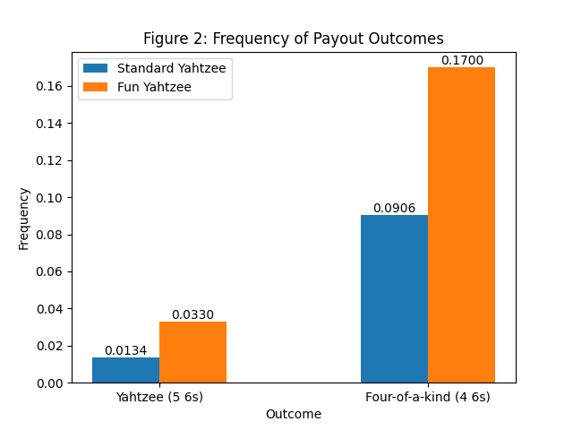

Setup
=====
To build the test, run `make` in this folder. Then, the test can be executed with `make test`. Finally, run `python3 analysis.py` to analyze the logfiles and generate graphs. The analyses below were done with `nTrials=10000`.

Dice Fairness
=============

Let's say a player wanted to test if the dice were fair in our game. While the simulations run, the logfile tracks the number of times each possible die result (1-6) was rolled. This does not count any dice that are kept between rolls, only the initial dice and rerolls. The results are shown for 10,000 trials in Figure 1.

We will use a $\chi^2$ goodness-of-fit test to see if the results align with what's expected from fair dice. The critical value with 5 degrees of freedom and $\alpha=0.05$ is $\chi^2_{5,0.95} = 11.070$. By calcuating $\chi^2$ of the outcome distributions for each variant, we get:

$\chi^2_{\text{Std}} = 1.75679 < 11.070$

$\chi^2_{\text{Fun}} = 4370.01 > 11.070$

**Thus, we can reject the dice being fair for Fun Yahtzee but not for Standard Yahtzee.** This makes sense because Fun Yahtzee always rigs a 6  at the start of the game, while Standard Yahtzee uses a random number for all rolls.

Game Results
============

Using this [Google Spreadsheet](https://docs.google.com/spreadsheets/d/1O9DeqmWleGxvstnNYvIx1Zlqm-jdqgEUal29Eh2AhlQ/edit?usp=sharing), I calculated the theoretical probabilities of each game result: Yahtzee (5 6s), Four-of-a-kind (4 6s), and No Payout. The values are summarized here:

|Variant    | $P(\text{Yahtzee})$ | $P(\text{Four-of-a-kind})$| $P(\text{No Payout})$ |
|-----------|-------------:|-------------------:|-----------:|
|Standard   |      0.013057|            0.091154|    0.895789|
|Fun        |      0.031503|            0.173093|    0.795404|

Figure 2 plots the frequencies for each result after 10,000 trials. The No Payout result is excluded to make the scale more readable.

Upon inspection, we see the frequencies are all within 5\% of theoretical probabilities. We can calculate the $\chi_2$ variance from the expected distributions, getting the following:

$\chi^2_{\text{Std}} = 0.124271$

$\chi^2_{\text{Fun}} = 1.296076$

These are very low, so we definitely cannot reject the hypothesis that the simulations match the theoretical distributions. However, calculating the chance of a Type II error (accepting a false hypothesis) is outside the scope of this analysis, since there are an infinite number of possible distributions the results could follow.

Average Payout
==============

Finally, we can do a qualitative analysis of the average payout. Using the theoretical probabilites in the Spreadsheet we can calucate the Expected Payout for each variant:

|  Variant   | Expected Payout per Game |
|------------|--------------------:|
|Standard    |               $ 3.13|
|Fun         |               $ 6.61|

Figure 3 shows the moving average of Payout for the same 10,000 trials as in the previous sections. The expected payouts are plotted with dashed lines. The moving averages do approximately align with the theoretical payouts; however, more trials would be needed to show a tighter convergence.

