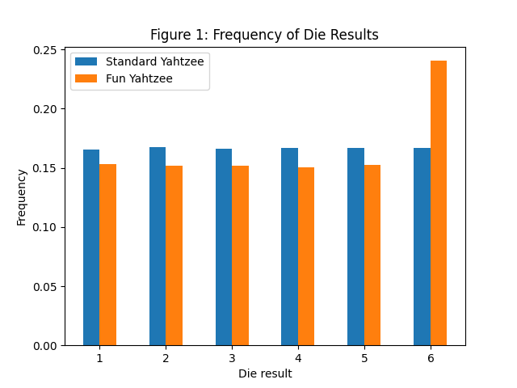

Setup
=====
To build the test, run `make` in this folder. Then, the test can be executed with `make test`. Finally, run `python3 analysis.py` to analyze the logfiles and generate graphs.

Roll Counts
===========

Let's say a player wanted to test if the dice were fair in our game. While the simulations run, the logfile tracks the number of times each possible die result (1-6) was rolled. This does not count any dice that are kept between rolls, only the initial dice and rerolls. The results are shown for 1,000,000 trials in Figure 1.

We will use a $\chi^2$ goodness-of-fit test to see if the results align with what's expected from fair dice. The critical value with 5 degrees of freedom and $\alpha=0.05$ is $\chi^2_{5,0.95} = 11.070$. By calcuating $\chi^2$ of the outcome distributions for each variant, we get:

$\chi^2_{\text{Std}} = 4.383 < 11.070$

$\chi^2_{\text{Fun}} = 414.741 > 11.070$

**Thus, we can reject the dice being fair for Fun Yahtzee but not for Standard Yahtzee.** This makes sense because Fun Yahtzee always rigs a 6  at the start of the game, while Standard Yahtzee uses a random number for all rolls.

Payout Results
==============

Using this [Google Spreadsheet](https://docs.google.com/spreadsheets/d/1O9DeqmWleGxvstnNYvIx1Zlqm-jdqgEUal29Eh2AhlQ/edit?usp=sharing), I calculated the theoretical probabilities of each payout result. The values are summarized here:

|Variant    | $P(\text{Yahtzee})$ | $P(\text{Four-of-a-kind})$|
|-----------|-------------:|-------------------:|
|Standard   |      0.013057|            0.091154|
|Fun        |      0.031503|            0.173093|
